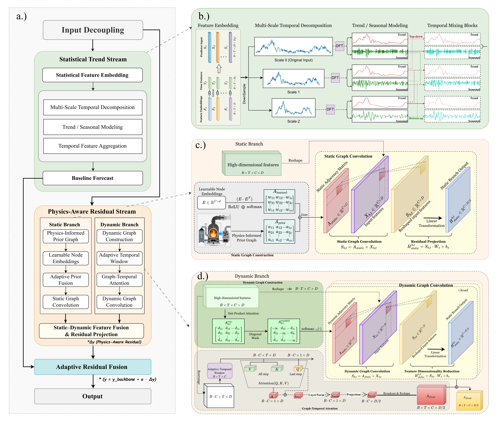
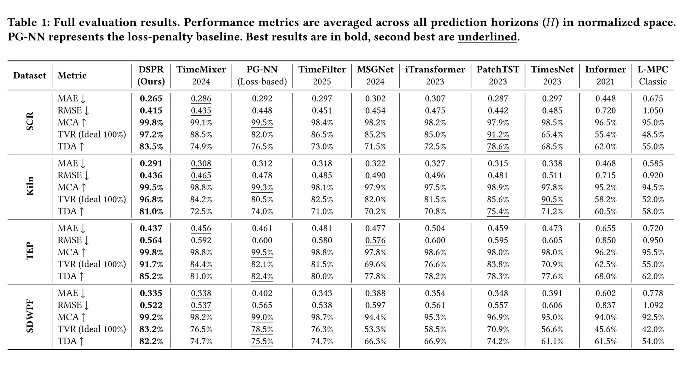

# DSPR-Industrial-Forecasting

This repository contains the official PyTorch implementation for the paper:

**"DSPR: Dual-Stream Physics-Residual Networks for Trustworthy Industrial Time Series Forecasting"**.

## Introduction

Forecasting complex industrial systems—spanning chemical kinetics, thermal dynamics, and energy meteorology—requires balancing statistical precision with physical plausibility. While standard deep learning models often achieve low prediction errors (MSE/MAE), they frequently violate fundamental conservation laws and causal relationships, a phenomenon we term **"fidelity collapse."**

**DSPR (Dual-Stream Physics-Residual Network)** addresses this challenge by shifting physics integration from passive loss penalties to **active architectural inductive biases**. Rather than forcing a single model to capture all dynamics, DSPR explicitly decouples the forecasting workflow into two specialized streams:

1. **Statistical Trend Stream**: Captures high-energy, inertial temporal patterns using a robust statistical forecaster, ensuring stable baseline performance.

2. **Physics-Aware Residual Stream**: Models regime-dependent deviations and transient dynamics through physics-guided dynamic graphs and adaptive temporal windows that respect flow-dependent transport delays.

This architectural decoupling enables DSPR to achieve state-of-the-art predictive accuracy while maintaining near-ideal physical fidelity, bridging the gap between data-driven forecasting and trustworthy industrial deployment.


## Methodology


*Figure 1: **The dual-stream architecture of DSPR.** The Statistical Stream captures global trends, while the Physics-Aware Stream explicitly models regime-dependent residuals through adaptive delays and dynamic graphs.*

The DSPR framework addresses non-stationarity in industrial systems by structurally decoupling dynamics into two orthogonal components: a stable **Statistical Trend Stream** and a regime-dependent **Physics-Aware Residual Stream**.

The **Statistical Trend Stream** serves as the backbone forecaster. Utilizing **TimeMixer**, it captures high-energy, inertial temporal patterns and global evolution, prioritizing stability to maintain robust baseline performance in noisy environments. By absorbing dominant trends, it enables the secondary stream to focus exclusively on modeling complex local deviations that standard regressors often miss.

The **Physics-Aware Residual Stream** captures transient fluctuations and regime shifts through two parallel branches. The **Static Branch** encodes time-invariant spatial constraints by fusing a domain-specific physical prior matrix ($\mathbf{A}^{\text{prior}}$) with learnable node embeddings, constructing a stable graph topology that respects fundamental system connectivity. Simultaneously, the **Dynamic Branch** addresses non-stationary physics via two key mechanisms:

1. An **Adaptive Window Mechanism** that learns flow-dependent transport delays ($\tau_{t,c}$). Unlike fixed lookback windows, this module dynamically adjusts the receptive field for each variable based on current operating conditions, aligning asynchronous signals caused by varying flow rates.

2. A **Physics-Guided Dynamic Graph** that separates causal interactions from spurious correlations by computing a time-varying adjacency matrix to capture transient couplings emerging only under specific regimes (e.g., high-load vs. idle states).

Finally, outputs from both streams are integrated via a **Gated Fusion Mechanism**. A learnable gating vector adaptively weights the physical residual contribution, adding it to the trend forecast only when regime-specific corrections are necessary. This architectural bias ensures adherence to physical laws without sacrificing statistical precision.


## Installation

The environment setup follows the standard `Time-Series-Library` benchmark but excludes heavy dependencies required for Large Language Models (LLMs).

**Requirements:**

* Python 3.8+
* PyTorch 1.10+
* NVIDIA CUDA toolkit (for GPU acceleration)

**Step 1: Clone the repository**

```bash
git clone https://github.com/ryanzhang369/DSPR-Industrial-Forecasting.git
cd DSPR-Industrial-Forecasting

```

**Step 2: Install dependencies**

```bash
pip install -r requirements.txt

```


## Datasets

Due to licensing constraints, raw data is not distributed with this repo. Please download and place them in the `./dataset` directory.

1. **TEP (Tennessee Eastman Process)**:
* Download `TEP_FaultFree_Training.RData` from [Harvard Dataverse](https://www.google.com/search?q=https://dataverse.harvard.edu/dataset.xhtml%3FpersistentId%3Ddoi:10.7910/DVN/6C3JR1).


2. **SDWPF (Solar/Wind Power)**:
* Download `wtbdata_245days.csv` from [Baidu AI Studio](https://www.google.com/search?q=https://aistudio.baidu.com/datasetdetail/105634).


3. **SCR & Rotary Kiln**:
* These datasets are proprietary industrial data and cannot be released due to company privacy policies.


## 🧪 Experiments

We evaluate DSPR on four diverse industrial datasets spanning Chemical Kinetics (**SCR**), Thermodynamics (**Rotary Kiln**), Process Control (**TEP**), and Fluid Dynamics (**SDWPF**). These benchmarks represent a spectrum from micro-scale reactions to macro-scale environmental physics, testing DSPR's generalization across heterogeneous physical regimes.

DSPR achieves Pareto-optimal performance, simultaneously reducing forecasting error (MAE/RMSE) compared to state-of-the-art baselines while enforcing strict adherence to physical laws—resolving the accuracy-fidelity dilemma that plagues conventional data-driven models.


*Figure 3: **Performance comparison on industrial benchmarks.** DSPR achieves Pareto-optimal performance. It not only reduces forecasting error (MAE/RMSE) compared to state-of-the-art baselines but also enforces strict adherence to physical laws, maintaining **>99% Mean Conservation Accuracy** and high signal fidelity (**TVR 88%–97%**) across all datasets.*

### Key Evaluation Metrics

- **MCA (Mean Conservation Accuracy):** Quantifies the percentage of predictions satisfying physical constraints (e.g., mass/energy balance). Higher values indicate better physical consistency.

- **TVR (Total Variation Ratio):** Assesses whether the model captures realistic signal volatility versus over-smoothing artifacts. Values approaching 100% indicate preservation of physically meaningful transients.

- **TDA (Trend Directional Accuracy):** Evaluates correctness of predicted trend directions, measuring the model's ability to anticipate regime transitions.


## Usage

**Training Example**
To train the model on the TEP dataset:

```bash
python run.py \
  --is_training 1 \
  --root_path ./dataset/TEP/ \
  --data_path TEP.csv \
  --model_id TEP_96_96 \
  --model DSPR \
  --data custom \
  --features M \
  --seq_len 96 \
  --pred_len 96 \
  --enc_in 52 \
  --dec_in 52 \
  --c_out 52 \
  --des 'Exp' \
  --itr 1
```

---

### Contact

For any questions, please open an issue or contact [yerazhang2-c@my.cityu.edu.hk](mailto:yerazhang2-c@my.cityu.edu.hk).
