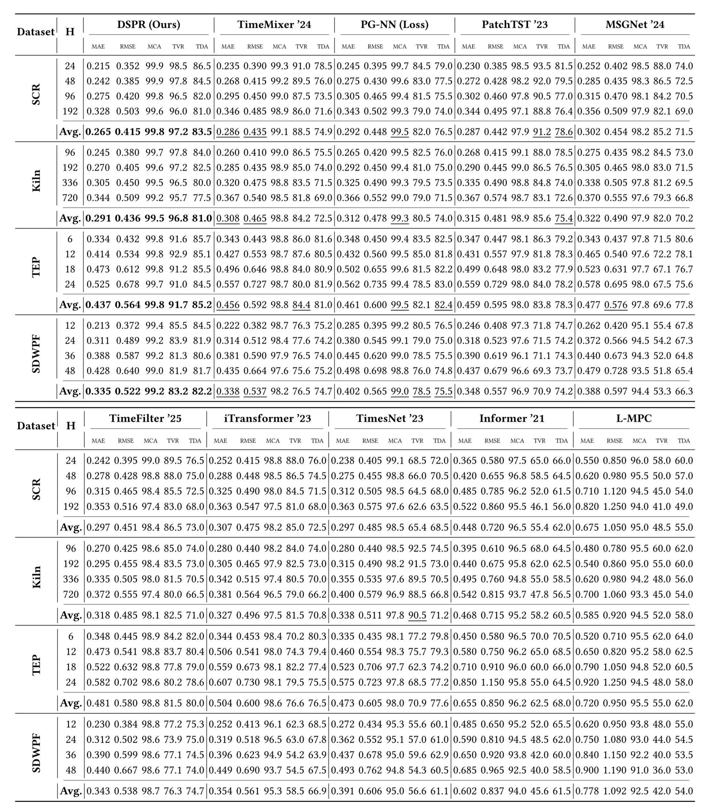

<p align="center">
  
  
  
  
  
</p>

<h1 align="center">DSPR: Dual-Stream Physics-Residual Networks</h1>
<p align="center"><strong>The Official PyTorch Implementation for KDD 2026 Paper</strong></p>

<p align="center">
  <a href="#introduction">Introduction</a> •
  <a href="#methodology">Methodology</a> •
  <a href="#installation">Installation</a> •
  <a href="#datasets">Datasets</a> •
  <a href="#experiments--full-results">Experiments</a> •
  <a href="#usage">Usage</a> •
  <a href="#citation">Citation</a>
</p>

---

## Introduction

Forecasting complex industrial systems across domains such as chemical kinetics, thermal dynamics, and energy meteorology requires a rigorous balance between statistical precision and physical plausibility. While standard deep learning models often achieve low prediction errors (MSE/MAE), they frequently violate fundamental conservation laws and causal relationships, a phenomenon we term **"fidelity collapse."**

**DSPR (Dual-Stream Physics-Residual Network)** addresses this challenge by shifting physics integration from passive loss penalties to **active architectural inductive biases**. Instead of forcing a single model to capture all complex dynamics, DSPR explicitly decouples the forecasting workflow into two specialized streams:

* **Statistical Trend Stream**: Captures high-energy, inertial temporal patterns using a robust statistical forecaster, ensuring stable baseline performance.
* **Physics-Aware Residual Stream**: Models regime-dependent deviations and transient dynamics through physics-guided dynamic graphs and adaptive temporal windows that respect flow-dependent transport delays.

> **Key Impact:** This architectural decoupling enables DSPR to achieve state-of-the-art predictive accuracy while maintaining near-ideal physical fidelity, effectively bridging the gap between data-driven forecasting and trustworthy industrial deployment.

---

## Methodology

<p align="center">
  
  <br />
  <em>Figure 1: <strong>The dual-stream architecture of DSPR.</strong> The Statistical Stream captures global trends, while the Physics-Aware Stream explicitly models regime-dependent residuals through adaptive delays and dynamic graphs.</em>
</p>

The DSPR framework addresses non-stationarity in industrial systems by structurally decoupling dynamics into two orthogonal components: a stable **Statistical Trend Stream** and a regime-dependent **Physics-Aware Residual Stream**.

* **Statistical Trend Stream (Backbone Forecaster)**: Utilizing **TimeMixer**, it captures high-energy, inertial temporal patterns and global evolution, prioritizing stability to maintain robust baseline performance in noisy environments. By absorbing dominant trends, it enables the secondary stream to focus exclusively on modeling complex local deviations that standard regressors often miss.
* **Physics-Aware Residual Stream**: Captures transient fluctuations and regime shifts through two parallel branches:
  1. **Static Branch**: Encodes time-invariant spatial constraints by fusing a domain-specific physical prior matrix ($\mathbf{A}^{\text{prior}}$) with learnable node embeddings, constructing a stable graph topology that respects fundamental system connectivity.
  2. **Dynamic Branch**: Addresses non-stationary physics via an *Adaptive Window Mechanism* that learns flow-dependent transport delays ($\tau_{t,c}$) to align asynchronous signals, alongside a *Physics-Guided Dynamic Graph* that separates causal interactions from spurious correlations by computing a time-varying adjacency matrix.

Outputs from both streams are seamlessly integrated via a **Gated Fusion Mechanism**. A learnable gating vector adaptively weights the physical residual contribution, adding it to the trend forecast only when regime-specific corrections are necessary.

---

## Installation

The environment setup follows the standard `Time-Series-Library` benchmark but excludes heavy dependencies required for Large Language Models (LLMs).

### Requirements
* Python 3.8+
* PyTorch 1.10+
* NVIDIA CUDA toolkit (for GPU acceleration)

```bash
# Step 1: Clone the repository
git clone [https://github.com/ryanzhang369/DSPR-Industrial-Forecasting.git]
cd DSPR-Industrial-Forecasting

# Step 2: Install dependencies
pip install -r requirements.txt

```

---

## Datasets

Due to licensing constraints, raw data is not distributed with this repository. Please download and place the files in the corresponding `./dataset` directory.

| Dataset | Type | Physical Prior Type | Source Link / Availability |
| --- | --- | --- | --- |
| **TEP** | Public | Coupled Reaction Kinetics | [Harvard Dataverse](https://dataverse.harvard.edu/dataset.xhtml?persistentId=doi:10.7910/DVN/6C3JR1#) |
| **SDWPF** | Public | Fluid Dynamics & Wind Kinematics | [Baidu AI Studio](https://aistudio.baidu.com/competition/detail/152/0/introduction) |
| **SCR** | Proprietary | Local Mass Balance | Private (Protected by corporate IP policies) |
| **Rotary Kiln** | Proprietary | Multi-Regime Thermodynamics | Private (Protected by corporate IP policies) |

---

## Experiments & Full Results

> **Supplementary Note:** Due to strict space constraints in the KDD 2026 proceedings, the granular performance breakdown across varying prediction horizons is provided as supplementary material. For offline reading, please refer to the [`Supplementary_Material.pdf`](https://www.google.com/search?q=./Supplementary_Material.pdf) located in the repository root.

We evaluate DSPR on four diverse industrial datasets representing a spectrum from micro-scale reactions to macro-scale environmental physics, rigorously testing DSPR's generalization across heterogeneous physical regimes.

### Physical Time Constants & Evaluation Horizons ($H$)

Prediction horizons ($H$) are explicitly customized to align with the intrinsic physical time constants and control dynamics of each heterogeneous system:

| Dataset / Domain | Horizon Range ($H$) | Physical Optimization Target & Rationale |
| --- | --- | --- |
| **SCR** (Chemical) | `24, 48, 96, 192` | Captures rapid reaction kinetics and variable transport delays driven by fluctuating gas velocity. |
| **Kiln** (Thermal) | `96, 192, 336, 720` | Extends to longer durations to evaluate slow-moving thermodynamic trends under massive thermal inertia. |
| **TEP** (Process Control) | `6, 12, 18, 24` | Restricted to the *transient response window* before feedback controllers fully stabilize reactor pressure. |
| **SDWPF** (Wind Energy) | `12, 24, 36, 48` | Strictly targets the *inertial forecasting regime* for the ultra-short-term dispatch market before chaos dominates. |

### Performance Highlights

<p align="center">
  
  <br />
  <em>Figure 2: <strong>Granular performance comparison on industrial benchmarks.</strong> DSPR not only achieves the lowest MAE/RMSE but also maintains <strong>&gt;99% Mean Conservation Accuracy</strong> and high signal fidelity (<strong>TVR 83%–97%</strong>) across both short-term transients and long-term horizons.</em>
</p>

DSPR achieves Pareto-optimal performance across all benchmarks. It simultaneously reduces forecasting statistical errors (MAE/RMSE) compared to state-of-the-art baselines while enforcing strict adherence to physical laws.

### Key Evaluation Metrics

* **MCA (Mean Conservation Accuracy)**: Quantifies the percentage of predictions satisfying physical constraints (e.g., mass/energy balance). Higher values indicate better physical consistency.
* **TVR (Total Variation Ratio)**: Assesses whether the model captures realistic signal volatility versus producing over-smoothing artifacts. Values closer to 100% indicate successful preservation of physical transients.
* **TDA (Trend Directional Accuracy)**: Evaluates the correctness of predicted trend directions during significant state shifts, measuring adherence to physical causality.

---

## Usage

### Training Example

To train the model on the TEP benchmark dataset, execute the following script:

```bash
python main_dspr.py \
  --is_training 1 \
  --root_path ./dataset/TEP/ \
  --data_path TEP.csv \
  --model_id TEP_96_96 \
  --model DSPR \
  --data custom \
  --features M \
  --seq_len 96 \
  --pred_len 96 \
  --enc_in 52 \
  --dec_in 52 \
  --c_out 52 \
  --des 'Exp' \
  --itr 1

```

---

## Contact

For any questions, please open an issue or contact [yeranzhang36@gmail.com]().

## Citation

If you find this repository or our paper useful in your research, please consider citing our work:

```bibtex
@inproceedings{zhang2026dspr,
  title={DSPR: Dual-Stream Physics-Residual Networks for Trustworthy Industrial Time Series Forecasting},
  author={Zhang, Yeran and Yang, Pengwei and Wang, Guoqing and Li, Tianyu},
  booktitle={Proceedings of the 32nd ACM SIGKDD Conference on Knowledge Discovery and Data Mining},
  pages={--},
  year={2026}
}

```
